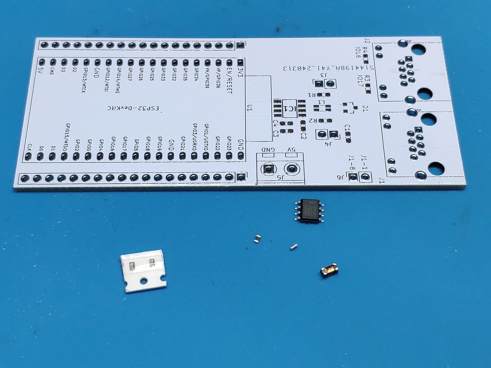
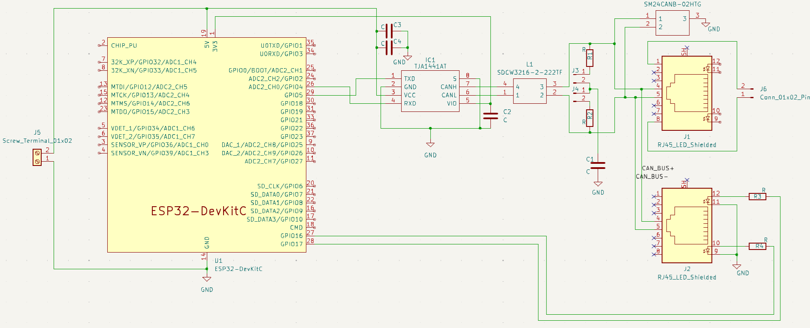

KiCADで作ったPCBデータです．  
CANバスをチェックするためのアナライザをESP32-DevKitCとTJA1441AT（NXP）で作ります．  

CANバスとは，RJ45で接続します．中心寄りの2芯を使っています．  
RJ45を2個搭載できるようになっているので，数珠つなぎにできます．従ってこのまま，センサノードとして利用しやすくなっています．  
ESP32_DevKitCの全ピンが引き出されており，重ねる基板を作りやすくなっています．  

# BoM
網羅はできていませんが，だいたいこんなものがあればよいのではないでしょうか．  

回路 | 部品(Item) | 説明 | 数量(Qauntity) | Akizukiコード
---|---|---|---|---
U1 | ESP32-DevKitC | ESP32マイコン・ボード| 1 | 115673
IC1 | TJA1441AT | CANトランシーバ| 1 | 117464
R1, R2 | 60.4Ω 1608 | 終端抵抗 | 2 | 
R3, R4 | 120Ω 1608 | LED電流制限抵抗 | 4 |
C1 | 0.0047uF 1608 | 終端抵抗スプリッタ | 1 | 114552
C2, C3 | 0.1uF 1608 | パスコン | 2 | 113374
C4 | 1uF 1608 | パスコン | 1 | 
J5 | 端子台 | 電源供給用（OPTION） | 1 | 101306
L1 | SDCW3216-2-222TF | コモンモードチョークコイル | 1 | 110382
D1 | SM24CANB-02HTG | TVS | 1 | （秋月電子取扱無し）
J3, J4 | ピンヘッダ 1x2 | 終端抵抗選択用 | 2 | 
J1, J2 | Amphenol_RJHSE538X | RJ45ジャック（CANバス接続用） | 2 | 
J6 | ピンヘッダ 1x2 | 拡張用ピンヘッダ（OPTION） | 1 |

※RJ45ジャックはいろいろあるので注意  
※コモンモードチョークコイル，TVSは無くても動く  

# Schematics

# 使用例

